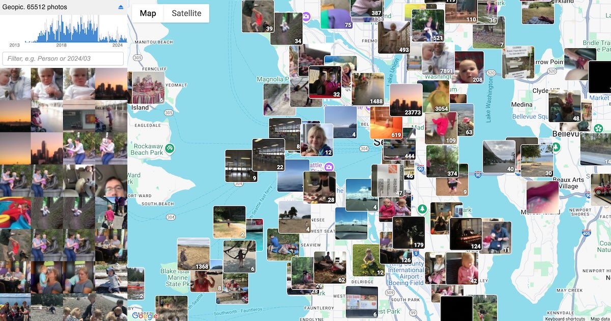

# Geopic

View your vacation photos on an interactive world map. Zoom in to photos from home when your kids were young. **Geopic** is a fast way to view your OneDrive photo and video collection.
* Try it out: https://unto.me/geopic
* Video demo: https://youtu.be/0ewFBBdQN9o

## How it works

*Your photos remain private!* Everything remains on your own personal OneDrive. All Geopics does is read your Photos folder, and then store its index in "Apps > Geopic" folder for faster viewing. The photos never go anywhere else other than your personal OneDrive and your web browser.

**Relive your travels**. Click anywhere on the world map to see photos you took there. Zoom into your hometown, that beach in Hawaii, or the city you visited last summer. You can also right-click to zoom out.

**Slideshow mode**. Click on an image to enlarge it. While looking at photos/videos, there's also a full-screen button at the bottom right, and left/right buttons to either side. Click again (or press Escape) to dismiss and go back to the map.

**Search your collection**. Search for "Person" to find family photos, "Flower" for garden shots, "2024" to see last year's adventures, ".mov" (iPhone) or ".mp4" (Android) to find yur videos. Search works on photo tags, folder names and filenames.

**Find specific memories**. Use the timeline at the top left to jump to "that amazing week in Italy" or "when my kids were toddlers". Drag to select date-ranges. You can also zoom in to narrow it down.

*Geopic is still work in progress*. It sometimes feels a bit janky when you click or zoom and it doesn't do what you think it was going to do. I'm working on that...

## Troubleshooting

*Missing old photos?* Geopic only shows photos that have geotags. I used to use a digital camera until 2016 so none of my old photos have geotags and they don't show up here; only the new ones I took with my iPhone since then.

*Missing recent photos?* Make sure the OneDrive app on your phone has "Camera Backup" turned on, and is working. Sometimes it turn off by itself.

*Keyword searches not working?* Keyword searches are only based on a photo's folder name, filename, and the AI-powered tags that OneDrive itself applied to them (and it only has a few fairly generic tags like Person, Fashion, Flower, Restaurant). If you search for a placename like "Paris" it won't work unless you deliberately named one of your folders "Paris" on OneDrive. If you search for a family member name like "Fred" that won't work because OneDrive doesn't use personal information in its tags. You can see what tags OneDrive chose for a photo when you enlarge it.

*Slow loading?* The first time you use Geopic, it has to look at every single one of your photos to find their locations. This takes up to half an hour for 50,000 photos (about ten year's worth). It writes an index of everything it found, so it's pretty much instantaneous next time.

*Doesn't work on mobile?* Sorry, Geopic has only been designed for desktop, and has only been tested on Chrome. That's work in progress.

*Something's stuck?* Try logging out ⏏, refreshing your browser, and reloading.

*Error while indexing?* Building an index is demanding! It needs to read every single photo from your OneDrive! Sometimes you'll see (throttling), which Geopic does automatically when Microsoft's OneDrive servers are overloaded; that's normal. Sometimes they'll just randomly flake out and you'll see an error message. Try refreshing and try again: that normally fixes it. If that doesn't work then logout ⏏, reload the page, and try again. If you keep getting an error message every single time, please create an issue here on github. You should copy+paste the exact error text that it produced.

## Contributing

1. `npm install` first time
2. `tsc` or `tsc --watch` to typecheck+build
3. View index.html in its intended final domain, in a web-browser...

This index.html is only functional in its intended final domain. This is because of two keys. If you are forking for your own domain, you'll need to get your own keys.
* **OneDrive Integration**: You need to register an application in the [Microsoft Azure Portal](https://portal.azure.com/) under your web domain, and get the CLIENT_ID key (stored in index.ts). The CLIENT_ID is tied specifically to that domain: when it does OAuth2 redirection, OneDrive checks CLIENT_ID, looks up its internal database of how the app is registered, and only allows authentication redirects to its registered redirect URI. The CLIENT_ID currently in index.ts only allows redirects to https://unto.me/geopics -- hosting it anywhere else won't work.
* **Google Maps integration**. You need to register yourself for Google Maps in the [Google Cloud Console](https://console.cloud.google.com/) and get a key. In the registration, you should remember to configure it to only allow Google Maps API requests from the domain you name. We pass the key in via the <script/> tag in index.html. The key currently in index.html only allows Google Maps API requests from https://unto.me/geopics -- hosting it anywhere else won't allow the Google Maps API calls to work.
